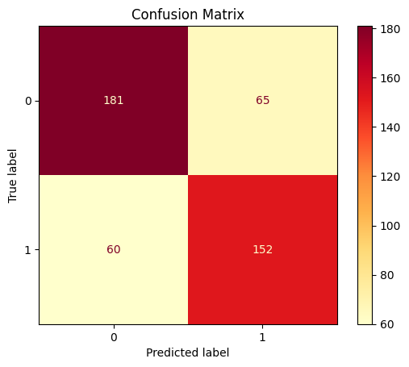

# Power-Outage-Prediction-Project
Project 5 DSC 80 Fall 2023

Names: Dhruv Kanetkar and Justin Chou

## Framing the Problem

### Identify the Problem: Can we predict whether or not a power outage was caused by severe weather?
From a general perspective, the first part to finding a solution (both preventative and responsive) is identifying the cause of the problem. With that in mind, we wanted to find a way to identify whether or not a major power outage was caused by severe weather from data that we'd have at the time of the outage in hopes of restoring the outage faster with that information.

> Justification

Whether or not a power outage was caused by severe weather is essential to allocating proper resources and setting up according preventative measures. Severe weather in this case could include a hurricane for example, which would require countermeasures such as increased insulation, and running power lines underground. This would be different for a power outage not caused by severe weather, such equipment failure, would indicate a necessary upgrade to the system which would be more intensive.

> Classification Problem and Response Variable

This is a classification problem as we are just trying to classify the cause of a major outage. This is binary classification, as we're just looking to predict whether or not the cause of the outage was severe weather. Our response variable will thus be the cause of the outage, or `CAUSE.CATEGORY` (once modified to be 1 if the cause was "severe weather" or 0 if it was another cause), as our goal is to predict this variable. 

> Evaluation Metric

As noted earlier, we think this information would be helpful in the restoration of outages when the time comes. The metric we are using to evaluate our model will be the accuracy. From looking at the dataset, the number of outages caused by severe weather is 759, whereas the number of outages not caused by severe weather is 766, meaning that the accuracy would not fail to capture the full picture of our model's effectiveness due to an imbalance in number of classifications. Since we do not have an imbalance in our data, using the F1-score would not be ideal. Additionally, we care just as much about the cases where the cause category is "severe weather" and when it is not, so accuracy is better for that reason as well over F1-score.

> Known Info at "Time of Prediction" and Features

One important point to note is that since we would not have information on the following columns at the time of the outage: `OUTAGE.RESTORATION`, `OUTAGE.DURATION`, `DEMAND.LOSS.MW`, `CAUSE.CATEGORY.DETAIL`, we cannot use this for our prediction. However, we will be incorporating other features such as: `YEAR`, `CLIMATE.REGION`, `CLIMATE.CATEGORY`, `TOAL.CUSTOMERS`, `ANOMALY.LEVEL`, and `CUSTOMERS.AFFECTED`. These values can be used as we would know that information at the time of a major power outage.

> Data Source and Cleaning

The data that we will be using will be sourced from Purdue University’s LASCI Research Data. This is the same data used in our Project 3 which can be found here [here](https://dhruvk0.github.io/Power-Outage-Research-Project). We have cleaned the data by fixing cell formatting, combining redundant columns, removing null values, imputing null values using median imputation, and converted all of the datatype to either `str`, `int64`, or `float64`. The code for cleaning our data was also used from our code for Project 3, while additionally removing columns we would not know at the time of prediction and encoding the `CAUSE.CATEGORY` with values of either 1 (If the cause is severe weather) and 0 (If the cause is not severe weather). Here are the first few rows of the cleaned dataset:

| OBS | YEAR | MONTH | U.S._STATE | POSTAL.CODE | NERC.REGION | CLIMATE.REGION | ANOMALY.LEVEL | CLIMATE.CATEGORY | CAUSE.CATEGORY | ... | POPPCT_UC | POPDEN_URBAN | POPDEN_UC | POPDEN_RURAL | AREAPCT_URBAN | AREAPCT_UC | PCT_LAND | PCT_WATER_TOT | PCT_WATER_INLAND | OUTAGE.START |
|-----|------|-------|------------|-------------|-------------|-----------------|---------------|-------------------|-----------------|-----|-----------|--------------|-----------|--------------|---------------|------------|----------|---------------|------------------|--------------|
| 0   | 2011 | 7     | Minnesota  | MN          | MRO         | East North Central | -0.3          | normal            | 1               | ... | 15.28     | 2279         | 1700.5    | 18.2         | 2.14          | 0.6        | 91.592666 | 8.407334      | 5.478743         | 2011-07-01 17:00:00 |
| 1   | 2014 | 5     | Minnesota  | MN          | MRO         | East North Central | -0.1          | normal            | 0               | ... | 15.28     | 2279         | 1700.5    | 18.2         | 2.14          | 0.6        | 91.592666 | 8.407334      | 5.478743         | 2014-05-11 18:38:00 |
| 2   | 2010 | 10    | Minnesota  | MN          | MRO         | East North Central | -1.5          | cold              | 1               | ... | 15.28     | 2279         | 1700.5    | 18.2         | 2.14          | 0.6        | 91.592666 | 8.407334      | 5.478743         | 2010-10-26 20:00:00 |
| 3   | 2012 | 6     | Minnesota  | MN          | MRO         | East North Central | -0.1          | normal            | 1               | ... | 15.28     | 2279         | 1700.5    | 18.2         | 2.14          | 0.6        | 91.592666 | 8.407334      | 5.478743         | 2012-06-19 04:30:00 |
| 4   | 2015 | 7     | Minnesota  | MN          | MRO         | East North Central | 1.2           | warm              | 1               | ... | 15.28     | 2279         | 1700.5    | 18.2         | 2.14          | 0.6        | 91.592666 | 8.407334      | 5.478743         | 2015-07-18 02:00:00 |

## Baseline Model

Our first model will be a decision tree classifier. We believe this is a good baseline because it'll serve as a proof of concept for a random forest classifier, while still being effective on its own. We're using a relatively smaller training set (test set makes up 0.3 of the full set), as in our initial tests with the model, we saw it had a tendency to overfit on the training data.

### Features:

1. `YEAR` -- We believe that one of the first things we should look at when building our model is the time at which the outage occured. We think that weather should have a general trend over time, so we're choosing to use this as a numerical variable. Though it shouldn't matter in a decision tree classifier, we thought it was good practice to encode a ***standard scaler*** to our year column.
2. `CLIMATE.REGION` -- We also think that place is an important feature to use when looking at outages. Certain regions may or may not be subject to more harsh weather conditions, which leads us to believe certain regions would have tendencies to have more outages caused by severe weather. We ***one-hot encoded*** this column such that categories could be represented numerically for our model.

As mentioned above, we think trends should occur over time, meaning we're leaving the years numeric. This makes `YEAR` a quantitative variable. The climate region is a nominal variable, as it's a categorical variable with no inherent order.
Therefore, we have ***one*** quantitative variable, ***one*** nominal variable, and ***zero*** ordinal variables in our base model.

Our encodings were done using a ColumnTransformer such that we would be able to apply different encoding methods to the different columns. We also used the `remainder="drop"` argument in our preprocessor, meaning that all other columns were omitted from our model.

### Analysis:

Model Statistics:
1. Accuracy: 0.73
2. Precision: 0.70
3. Recall: 0.72

We consider this model to be passable, but it definitely can be improved upon. The accuracy is 0.73, which is significantly better than that of a naive model which would always predict an outage was not caused by severe weather (and have an accuracy of around 0.51). However, being correct 73% of the time with no extreme tendency towards false positives or negatives (as shown by our precision and recall) would not make the model particularly useful on a practical basis (i.e. in the event of a major power outage). Therefore, we want to look into other features that can better our model.

The confusion matrix above shows that there are 181 True Positives (TP), 152 True Negatives (TN), 65 False Positives (FP), and 60 False Negatives (FN). This breakdown further gives us information on how to improve our model, as the precision and recall are still very low.

## Final Model

Our final model will most likely be a random forest classifier, though we will try other classification models to see whether or not they can outperform this model. We believe that the tree voting method will improve the steps in the decision tree, leading to a stronger model overall.

### Added Features

We ended up removing year our feature set, as upon further thinking, we decided that the changes in climate relative to time could be better captured by some of the features we included in our final model. However, we did leave in `CLIMATE.REGION` as encoded. Here are those features:

1. `CLIMATE.CATEGORY` -- We added climate category because this represents the climate episodes by year in each region. This means it provides context as to the climate relative to both time and location at the same time -- a good indicator for our model. This would allow us to capture what we were attempting to capture with the `YEAR` category. Because climate is the "long-term pattern of weather" (via National Geographic), we assumed that certain climates would lead to more severe weather leading to outages. This is a categorical, nominal variable (no inherent order), so we ***one-hot encoded*** this column.
2. `ANOMALY.LEVEL` -- This variable is similar to `CLIMATE.CATEGORY`, as it represents the climate episdes relative to both time and location -- this time, by season. This would provide a bit more granularity for understanding the climate, which we ultimately decided would improve the model. Because this variable is quantitative, we applied a ***standard scaler*** to this column.
3. `CUSTOMERS.AFFECTED` -- We wanted to first note that due to the existence of NaN values, we had to impute those. We chose to impute those using the median, as the mean was skewed due to the fact that there was a signficant number of entries below 75,000, but a few far above. Imputing by the median is an attempt to "dampen" the effect of the NaN values. We think, though, that the scale of the outage could be indicative of its cause. For example, an outage that wipes out a large number of people's electricity is more likely to be due to severe weather because it requires large infrastructural damage. Because this variable is quantitative, we applied a ***standard scaler*** to this column.
4. `TOTAL.CUSTOMERS` -- We think that total customers in the given state of the outage could be indirectly related with the cause of the outage. We think this because a greater demand for electricity could lead to stronger infrastructure being implemented, leading to more resilience particularly against severe weather. This was also a quantitative variable, so we applied a ***standard scaler*** to this column.

### Methods: Testing Models

1. ***Decision Tree Classifier*** -- We tried this model with the expectation that it would be slightly worse than the random forest classifier. Its accuracy was 0.85.
2. ***SVC*** -- We tried this model knowing that it tends to be less effective than the decision tree or the random forest classifier. Its accuracy was 0.78.
3. ***Random Forest Classifier*** -- As noted above, a random forest classifier is often a stronger model than the decision tree. Our first model yielded an accuracy of 0.87, so we decided to select this model to optimize with hyperparameters.

### Tuning Hyperparameters

1. ***Max Depth*** -- We think that max depth is an important hyperparameter to tune because we noticed that in our base model, our training accuracy was much higher than our testing accuracy -- indicating that overfitting was an issue. Restricting the max depth can help with overfitting because having less steps and thresholds could mean that our model is less sensitive to outliers or variation in the dataset. Therefore, we fitted our max depth.
2. ***n_estimators*** -- As mentioned above, we noticed some overfitting with our model. We also know that the number of trees voting on the final model can affect the fitness of the set, as a greater number of trees could lead to sensitivity to rather insignificant variation in our data.

To tune hyperparameters, we began by just messing around with numbers in different ranges to see approximately what range works best both for the max depth and the number of estimators. We ultimately found that the best max depth was low (< 30), as the models tended to be overfitted. We found that n estimators was best north of 300, which makes sense considering that a greater number of trees voting would result in a better overall model.

We then went on to use a GridSearchCV to try and fit the model, resulting in an accuracy of 0.88 with a depth of 10 and a number of estimators of 800. Though these results were useful, we also realized we had skipped over some possible combinations of hyperparameters. We figured that the smaller training sets, though covering all possibilities and averaging, led to different accuracies. Therefore, we then implemented a loop that manually tested hyperparameters -- depth between 2 and 30, and number of estimators between 100 and 1000. This would enlarge the training set when doing initial training, allowing us to better capture the effects of overfitting. This resulted in a greater accuracy, as we'll discuss below. Through manual iteration, we found slightly more optimized hyperparameters:

Our final parameters:
1. ***Max Depth***: 12
2. ***n_estimators***: 500

### Analysis

Model Statistics:
1. Accuracy: 0.8864
2. Precision: 0.90
3. Recall: 0.85

We consider this model to be significantly more useful than our base model, with this model being 16% more accurate than our base. Being able to predict with ~89% accuracy could give people relative confidence as to the cause of the outage and allow them to react accordingly. Though it's not 100%, we do think that on occassion, severe weather outages and intentional attacks for example could have similar effects in similar times/locations, leading to this 11% gap. However, we were impressed with the improvement over our base model.

## Accuracy Analysis

To do our fairness assessment, we will categorize our dataset into two groups: major power outages that affected less than 65,000 people and major power outages that affected more than 65,000 people. For this analysis we will classify power outages affecting more than 65,000 as a sever power outage. For our analysis our primary metric will be accuracy Our proposed null hypothesis is that our model's accuracy for determining a severe outage is roughly equivalent to an outage that is not severe. Our proposed alternative hypothesis is that our model is unfair, in that it has a higher accuracy for outages that are not severe than those that are classified as severe based on the amount of people affected. The test statistic we have chosen will be the difference in accuracy between severe and non-sever power outages, with a significance level of 0.01. For this analysis, we ran a permutation test 1,000 times and obtained a p-value of 0.001, which is within our significance level. This p-value leads us to reject the null hypothesis, indicating that our alternative hypothesis that the model has a higher accuracy for power outages that affect less than 65,000 people than power outages that affect more than 65,000 power outages. However we cannot assert with certaintly that our model is unfair as the permutation tests are created through random choice. Because of this we advise to conduct further testing with more data and permutations to determine whether or not the model is "truly fair".
